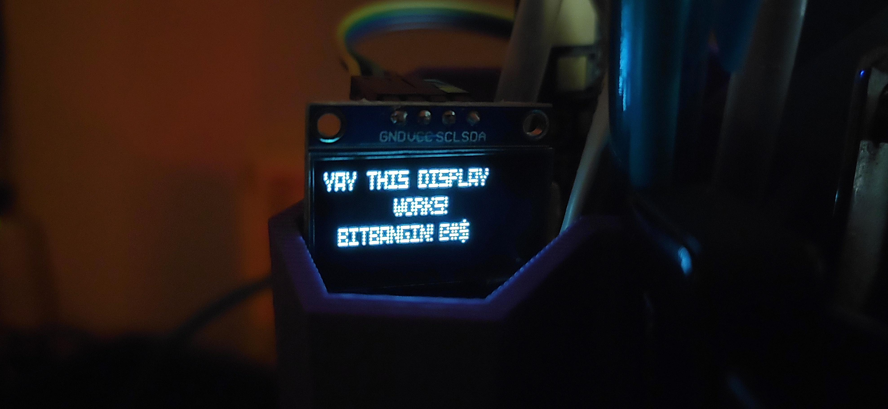

A super nifty ssd1306 library written in vanilla python3
========================================================

I needed an oled/ssd1306 display attached to a jetson nano for an ML training job monitor. I didnt feel like messing around with a bunch of external libraries that depend on rpi.gpio, so I whipped up this steaming pile of python. Only requirement is (apt-get install i2c-tools). All text is parsed and turned into a hex array that the i2cset command can handle in a subprocess call.
  
Done: String -> Hex font -> OLED display, clear screen, fill screen, cursor size changes.
  
Needs: Change baud on the i2c line, dynamic font handling (for other hex fonts), Asyncio for multiple subprocesses (maybe try writing to every page/line at once?), integrate some PIL stuff for image handling maybe, need to figure out a clean programatic way to do \r\n (keep count on each page/line and then add spaces to the end maybe?)
  

